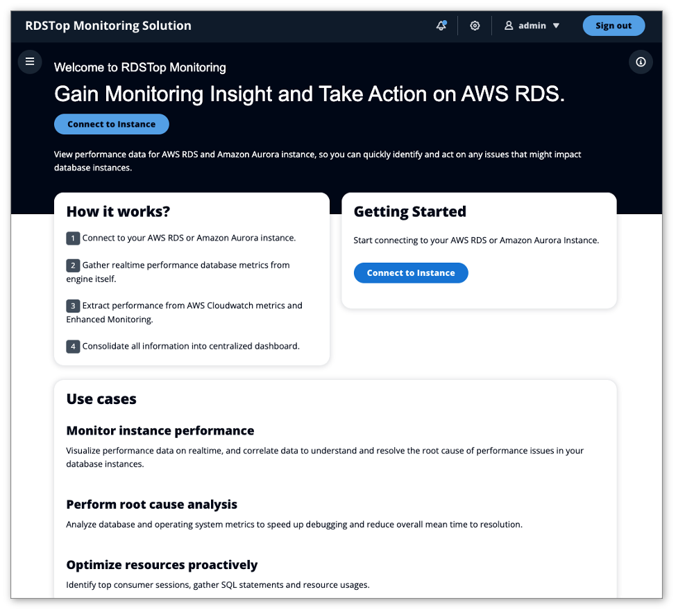
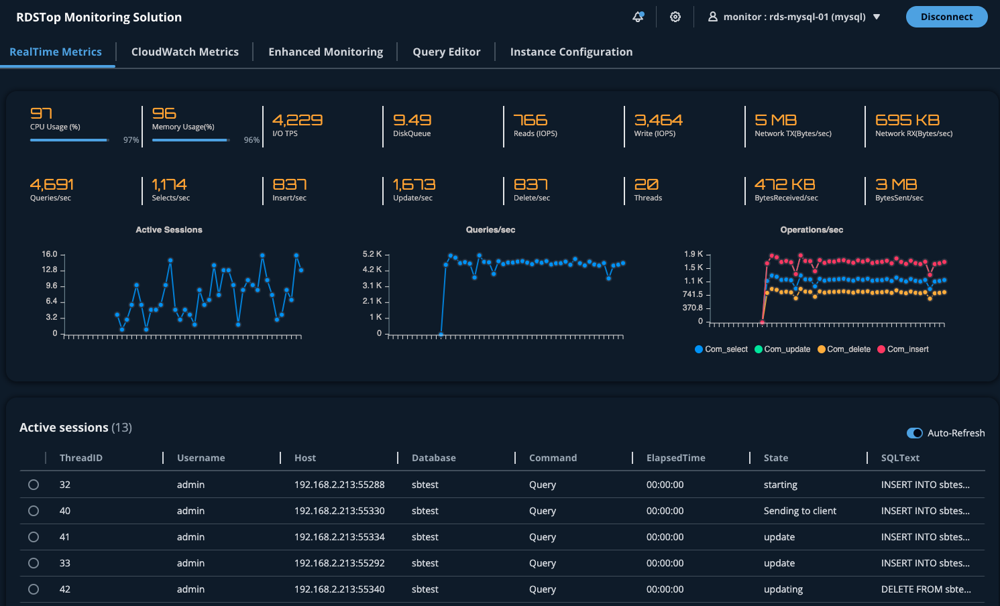

# RDSTop Monitoring Solution for AWS RDS

> **Disclaimer:** The sample code; software libraries; command line tools; proofs of concept; templates; or other related technology (including any of the foregoing that are provided by our personnel) is provided to you as AWS Content under the AWS Customer Agreement, or the relevant written agreement between you and AWS (whichever applies). You are responsible for testing, securing, and optimizing the AWS Content, such as sample code, as appropriate for production grade use based on your specific quality control practices and standards. Deploying AWS Content may incur AWS charges for creating or using AWS chargeable resources, such as running Amazon EC2 instances, using Amazon CloudWatch or Amazon Cognito.


## What is RDSTop Monitoring ?

RDSTop is lightweight application to perform realtime monitoring for AWS RDS and Amazon Aurora instances. 
Based on same simplicity concept of Unix top utility, provide quick and fast view of database performance, just all in one screen.




## How looks like RDSTop Monitoring ?



https://github.com/aws-samples/rds-top-monitoring/assets/135755418/6bd2d036-78cc-4010-8311-f1d6f27f70d6


## How it works?


## Database engine support

RDSTop Monitoring Solution currently supports following database engines:

- AWS RDS for MySQL
- AWS RDS for PostgreSQL
- AWS RDS for MariaDB
- Amazon Aurora MySQL-Compatible Edition
- Amazon Aurora PostgreSQL-Compatible Edition
- AWS RDS for Oracle
- AWS RDS for SQLServer


Additional expanded support coming later to :

- Amazon DocumentDB
- Amazon ElastiCache for Redis
- Amazon MemoryDB for Redis


## Solution Components

- **Frontend.** React Developed Application to provide user interface to visualize performance database information.

- **Backend.** NodeJS API Component to gather performance information from database engines, AWS CloudWatch and RDS Enhanced Monitoring.


## Architecture


## Use cases

- **Monitor instance performance.**
    Visualize performance data on realtime, and correlate data to understand and resolve the root cause of performance issues in your database instances.

- **Perform root cause analysis.**
    Analyze database and operating system metrics to speed up debugging and reduce overall mean time to resolution.

- **Optimize resources proactively.**
    Identify top consumer sessions, gather SQL statements and resource usages.


## Solution Requirements

#### Amazon RDS Enhanced Monitoring

Amazon RDS provides metrics in real time for the operating system (OS) that your DB instance runs on. RDSTop Monitoring solution integrate metrics from Enhanced Monitoring and it has to be enabled. 
Follow procedure below to turn on Enhanced Monitoring.

https://docs.aws.amazon.com/AmazonRDS/latest/UserGuide/USER_Monitoring.OS.Enabling.html


#### VPC Network Access to AWS RDS Instances

RDSTop Monitoring Solution needs to access privately AWS RDS Instances, grant access inboud rules and security groups.


## Solution Deployment


> **Time to deploy:** Approximately 10 minutes.


### Create database monitoring users

Database credentials are needed to connect to the database engine and gather real-time metrics, use following statements to create the monitoring users.

#### MySQL
```
CREATE USER 'monitor'@'%' IDENTIFIED BY '<PASSWORD>';
GRANT PROCESS ON *.* TO 'monitor'@'%' ;
```

#### PostgreSQL
```
CREATE USER monitor WITH PASSWORD '<PASSWORD>';
GRANT pg_read_all_stats TO monitor;
```

#### MS SQLServer
```
USE [master]
GO
CREATE LOGIN [monitor] WITH PASSWORD=N'<PASSWORD>', DEFAULT_DATABASE=[master], CHECK_EXPIRATION=ON, CHECK_POLICY=ON
GO
use [master]
GO
GRANT CONNECT SQL TO [monitor]
GO
GRANT VIEW SERVER STATE TO [monitor]
GO
```

#### Oracle
```
CREATE USER monitor IDENTIFIED BY '<PASSWORD>';
GRANT CREATE SESSION,SELECT ANY DICTIONARY TO monitor;
```


### Launch CloudFormation Stack

Follow the step-by-step instructions to configure and deploy the RDSTop into your account.

1. Make sure you have sign in AWS Console already.
2. Click the following button to launch the CloudFormation Console in your account and use Cloudformation template (RdsMonitoringSolution.template) located on conf folder.

[](https://console.aws.amazon.com/cloudformation/home#/stacks/create/template?stackName=RDSTopMonitoringSolution)

3. Input **Stack name** parameter. 
4. Input **Username** parameter, this username will be used to access the application. An email will be sent with temporary password from AWS Cognito Service. 
5. Input **AWS Linux AMI** parameter, this parameter specify AWS AMI to build App EC2 Server. Keep default value.
6. Select **Instance Type** parameter, indicate what instance size is needed.
7. Select **VPC Name** parameter, indicate VPC to be used to deploy application server.
8. Select **Subnet Name** parameter, indicate private subnet to be used to deploy application server. This private subnet needs to have internet access, also application server needs to be able to reach AWS RDS Instances, add appropiate inboud rules and security groups.
9. Select **PublicAccess** parameter, indicate if Public Address is needed. 
10. Input CIDR Inbound access rule for RDSTop Monitoring Solution.
11. Click **Next**, Click **Next**, select **acknowledge that AWS CloudFormation might create IAM resources with custom names**. and Click **Submit**.
12. Once Cloudformation has been deployed, gather application URL from output stack section. Username will be same you introduce on step 4 and temporary password will be sent by AWS Cognito Service.
13. Application deployment will take around 5 minutes to be completed.

> **Note:** Because you are connecting to a site with a self-signed, untrusted host certificate, your browser may display a series of security warnings. 
Override the warnings and proceed to the site. To prevent site visitors from encountering warning screens, you must obtain a trusted, 
CA-signed certificate that not only encrypts, but also publicly authenticates you as the owner of the site.


